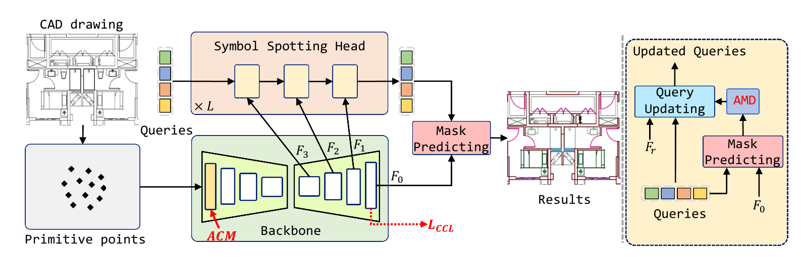

<h2 align="center">Symbol as Points: Panoptic Symbol Spotting
via Point-based Representation</h2>
<p align="center">
  
</p>


## 📋News
- **[2023/03/07]** 📢Our code and model weight is release.
- **[2024/03/01]** 📢Our paper is released in Arxiv, and camera ready version is updated. 
- **[2024/01/16]** 🎊SymPoint is accepted by **ICLR 2024**.


## 🔧Installation & Dataset
#### Environment

We recommend users to use `conda` to install the running environment. The following dependencies are required:

```bash
conda create -n spv1 python=3.8 -y
conda activate spv1

pip install torch==1.10.0+cu111 torchvision==0.11.0+cu111 -f https://download.pytorch.org/whl/torch_stable.html
pip install gdown mmcv==0.2.14 svgpathtools==1.6.1 munch==2.5.0 tensorboard==2.12.0 tensorboardx==2.5.1 detectron2==0.6
python -m pip install 'git+https://github.com/facebookresearch/detectron2.git'

# compile pointops
cd modules/pointops
python setup.py install
```

#### Dataset&Preprocess

download dataset from floorplan website, and convert it to json format data for training and testing.

```python
# download dataset
python download_data.py
# preprocess
#train, val, test
python parse_svg.py --split train --data_dir ./dataset/train/train/svg_gt/
python parse_svg.py --split val --data_dir ./dataset/val/val/svg_gt/
python parse_svg.py --split test --data_dir ./dataset/test/test/svg_gt/
```

## 🚀Quick Start

```
#train

#test
bash tools/test_dist.sh
```
If everything goes well, you can obtain following result:

<p align="center">
  
</p>

## 🔔Tips
**[Configs]** Each edit step needs 10000 steps for optimizing. 
Therefore, ``max_steps`` needs to be modified in different editing processes.
Moreover, many configs should be relative to the ``max_steps`` including ``resolution_milestones, ambient_only_steps, min/max_step_percent, lambda_consistency/init``, more details can be referred in provided configs.

**[Prompt]** Expected input prompt format is A|B, where A is the source prompt and B is the target prompt.

**[Region Defination]** The editable region is defined as ``box_info=[box center; box size]`` in configs. Noticing that editable regions can be defined as multiple boxes:
```
# Example for inputing multiple boxes as region defination 
box_info: 
  - [2.0, 0.5, 1.0, 0.0, 0.0, -0.6]
  - [1.0, 0.4, 1.0, 0.0, -0.4, 0.2]
```

**[Axis]** The positive directions of the x,y,z-axis in Progressive3D are point out of screen, point to right and point to up, respectively.

**[Camera Move]** ``move_camera`` in configs determines whether use camera move techique or not. Concretely, camera will move towards to the direction of editable regions if ``move_camera=True``, which enhances the editing peformance for many cases.

## 📌Citation
If you find our paper and code useful in your research, please consider giving a star and citation.
<pre><code>
    @article{liu2024symbol,
  title={Symbol as Points: Panoptic Symbol Spotting via Point-based Representation},
  author={Liu, Wenlong and Yang, Tianyu and Wang, Yuhan and Yu, Qizhi and Zhang, Lei},
  journal={arXiv preprint arXiv:2401.10556},
  year={2024}
}
</code></pre>